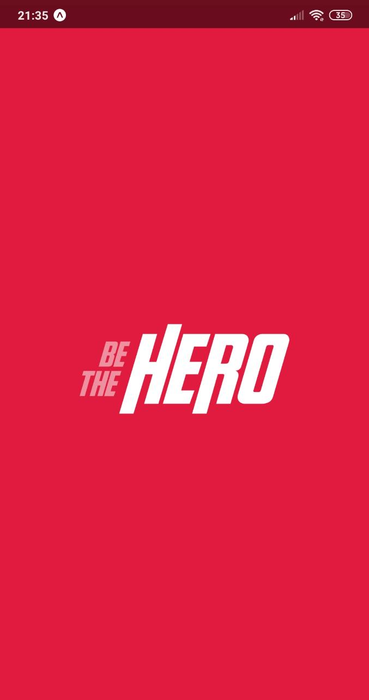
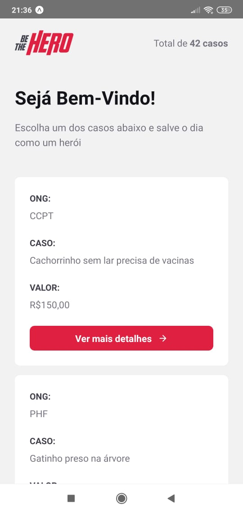

<h3 align="center">
    
    <br>
   The client side app for people that want be the hero!
   </br>
</h3>

<div  align="center" style=margin:30px >

 
 
 

</div>

## Libs used

- [React Native](https://reactjs.org/)
- [Axios](https://github.com/axios/axios)
- [React-Icons](http://react-icons.github.io/react-icons/)

- [Reactotron](https://infinite.red/reactotron)
- [Expo](http://expo.com)

## Let's run

```bash
# Clone this repository
$ git clone https://github.com/paulohlips/beTheHero

# Go into the repository
$ cd mobile

# Install dependencies
$ yarn install

# Run the app
$ react-native run-android ( or run-ios)
```
